# Mittens

Designed to keep your life on track. Wearing a pendant for ambient observation and speak to you through TTS to remind you to take a break from work, leave for your appointments. Mittens runs on your phone. It tracks your nutrition from your meals, smart inventory of your pantry, recommends groceries from USDA FoodData and your personal nutrition gap calculation, track your location to log your walking/biking/running/transit activities to recommend what to eat more or less, logs your sleep and activity, reflects on each of them with scientific research and data visualizations, remembers your friends' and family's faces, socialize and help you reflect on your life through stanford's life design philosophy. It sees what you eat, hears what you say, and remembers what matters to you.

<p align="center">
  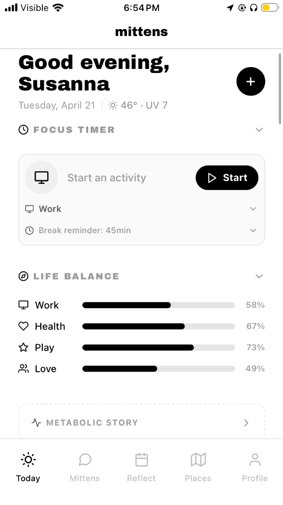
  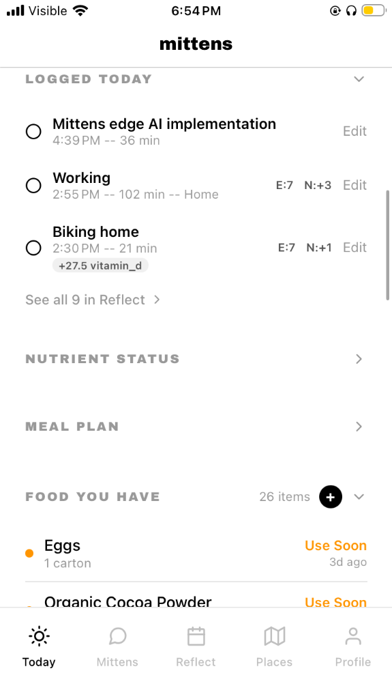
  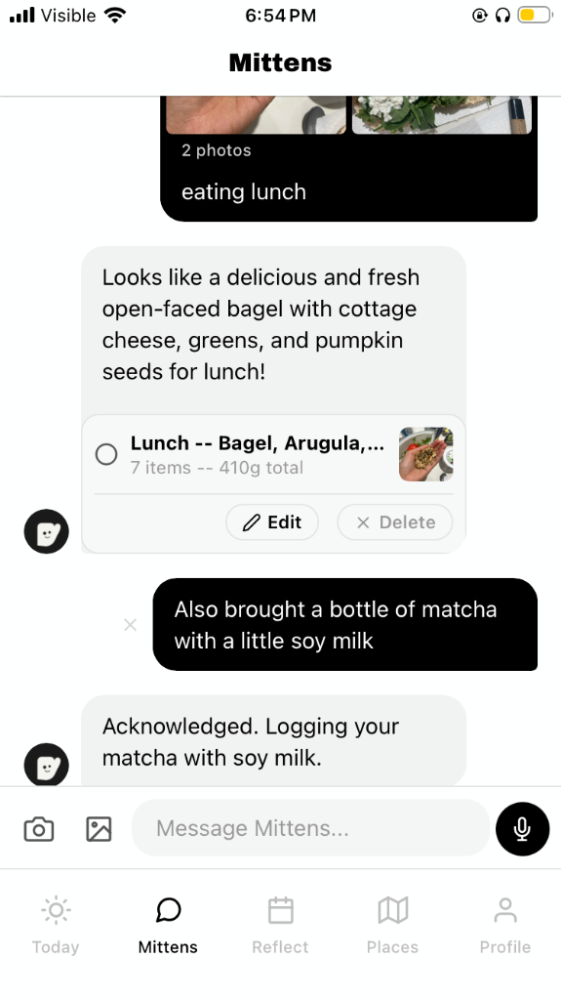
  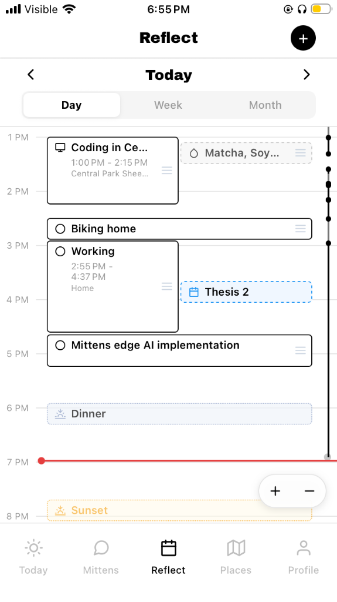
  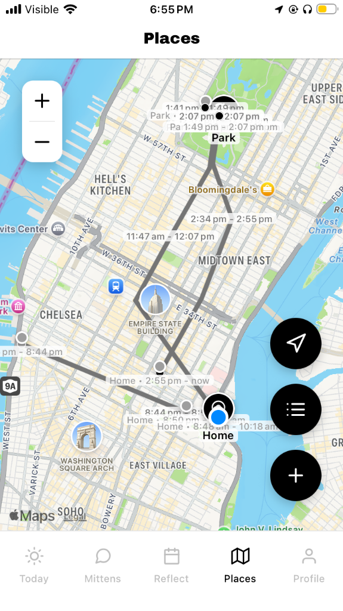
</p>


<p align="center">
  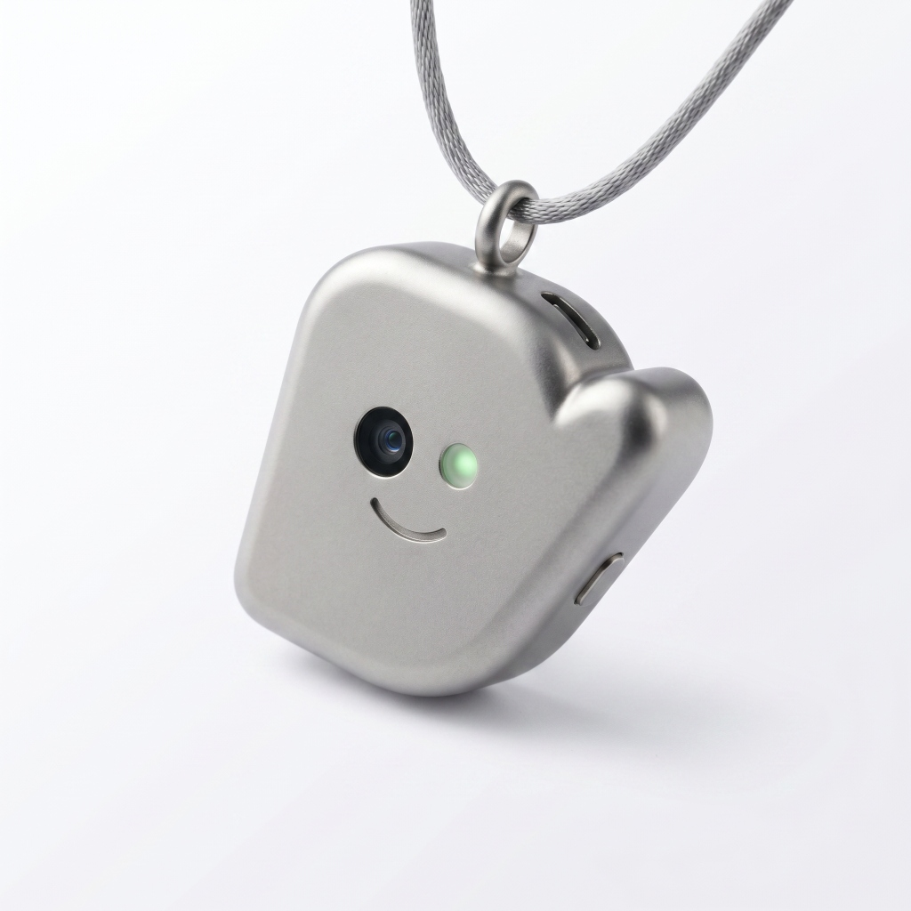
  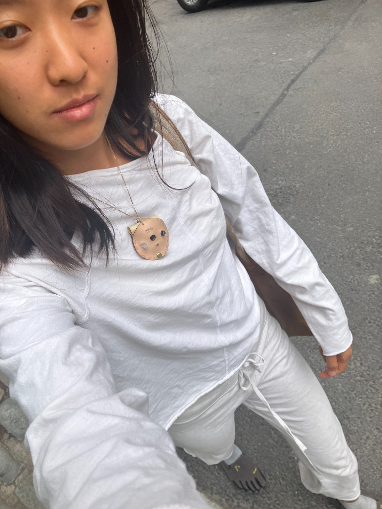
</p>

I test every detail of the wearbale, app, and pipelines throughout my daily life and make sure even small models can do things right instead of dumping large models with lots of parameters. And as models keep getting better, I believe the future everyone will have their own mittens living on the edge right in their pocket or on their body.


## What Mittens does

**Nutrition.** Photograph your meal and Mittens identifies every item, estimates 19 nutrients, tracks your gaps against RDA, and plans your next meal to close them. Two-phase AI: vision identifies the food, a separate knowledge call estimates nutrients. No cognitive overload, dramatically better accuracy. Bioavailability-aware (vitamin C enhances iron, calcium blocks it), source-aware (plant vs animal vitamin A), hydration from food water content. Meal planning uses a MILP solver to optimize nutrients across the day.

<p align="center">
  
  
  
</p>

### How nutrition analysis actually works (for nutrition education)

Most calorie-tracking apps treat a food as a fixed bag of numbers. Mittens treats a meal as a *system* — what's on the plate interacts with itself, and what the body absorbs is not what the label says. Tapping any food or any nutrient in Mittens opens an explanation panel so the app teaches as it logs.

**Phase 1 — Vision identifies the foods.** A single Gemma 4 vision call returns each item, an estimated cooked-or-raw weight, and a confidence score. The confidence is shown to the user (95%, 90%, 85% in the screenshot above), and any item can be tapped to edit name, weight, or cooking state. Low-confidence items prompt rather than silently guess.

**Phase 2 — USDA candidate selection.** For each identified food, the brain selects the best USDA FoodData entry from a shortlist of candidates ("AI selected USDA 'Corn, sweet, yellow, raw' from 5 candidates"). This is shown on the detail page so the user can see what the AI matched against and override it. Side-by-side **USDA** and **FINAL** columns make every adjustment visible.

**Phase 3 — Cooking adjustments.** Cooking destroys some nutrients (vitamin C, folate, B-vitamins) and concentrates others. Each affected nutrient gets a `COOKING` tag and a numeric correction applied to the USDA baseline. This is why the FINAL column differs from the USDA column for cooked foods — and why a "calories from raw spinach" lookup misleads you about a cooked dish.

**Phase 4 — Bioavailability across the whole meal.** This is the part nobody else does well. Mittens looks at every pair of nutrients across every food on the plate and applies peer-reviewed interaction rules:

- **Iron + Vitamin C → +50%** absorption (Fe³⁺ reduced to absorbable Fe²⁺) — sourced from broccoli + black beans + red cabbage together.
- **Iron − Calcium → −30%** absorption (transport competition in the same meal).
- **Zinc / Iron − Phytate → −35% / −50%** (chelation from grains and beans).
- **Calcium + Vitamin D → +30%** (active transport in the intestine).
- **Folate + Vitamin C → +20%** (oxidative protection in the gut).

Each interaction shows its source foods, the rule, the effect size at this dose, and the mechanism in one sentence. Users learn *why* their food works the way it does instead of just seeing a number change.

**Phase 5 — RDA gap tracking + MILP meal planning.** Final adjusted nutrients are tracked against your RDA for the day. The next meal is recommended by a mixed-integer linear-programming solver that minimizes your remaining gap subject to what's in your pantry and your dietary preferences. The solver is deterministic; the brain only proposes candidate foods, the math picks the combination.

All five phases are explainable end-to-end: tap any number, see which food contributed, which rule fired, and the citation behind the rule.

**Activity logging.** Photo, text, or manual — all inputs flow through the same pipeline. Every activity gets AEIOU tags (Activities, Environments, Interactions, Objects, Users), weighted life categories (work/health/play/love), engagement and energy ratings. Health impact computed deterministically with peer-reviewed citations. Movement trails from location tracking. Geofenced known places.

**Life Design.** Stanford Life Design philosophy, practiced daily. Lifeview and workview reflections. Nightly check-in that starts with your most important unreflected activity. Life balance gauges that break health into 7 research-backed pillars: nutrition, movement, sleep, gut health, nature exposure, circadian hygiene, and brain hygiene. Every metric is explainable — tap any gauge to see which logs affected it, by how much, and why, with tappable DOI-linked research citations.

**Sleep.** Tracks quantity, quality, sleep debt, and environmental factors (room temp, light, noise, screen time, caffeine timing). All backed by NIH, Harvard, CDC, and Sleep Foundation research.

**Smart pantry.** Photograph your fridge and Mittens inventories what's inside with freshness estimates. Meals auto-deduct from pantry. Grocery lists generated from meal plans cross-referenced against what you already have.

**Talk to Mittens.** The chat is the primary interface. Mittens classifies what you say or photograph and routes to the right pipeline — food, activity, sleep, pantry, or web lookup. It reads your calendar, searches past conversations, remembers your habits and preferences, and updates its memory as your life changes. Voice input and TTS output.

**Web + social lookup.** (coming soon) "Any free food from nycforfree today?" "Anything on HackerNews?" "New soft robotics papers — humanoid only, not marine." Mittens fetches the content (RSS, API, HTML scrape, or Instagram stories via server-side Instaloader), runs vision or text filtering through the brain, extracts structured details, and shows you cards. No polling — on-demand when you ask. Uses your lifeview/workview as implicit interest filters.

**People.** Mittens learns and recognizes the people in your life. Introduce someone by holding the pendant button and saying "Mittens, this is Caden" -- the on-device face recognition module (Apple Vision + CoreML) extracts a mathematical face embedding and saves it locally. Next time the pendant sees Caden during ambient capture, it matches the face via cosine similarity, retrieves interaction history and memories, and greets him with a unique, context-aware response generated by the brain. Recognition improves over time through reinforcement -- each new sighting from a different angle or lighting saves another embedding to the person's profile.

**Places & Transit.** Continuous location intelligence tracks movement trails and geofenced known places. Your daily GPS trails are automatically converted into activity blocks on your calendar (like walking, running, cycling, or transit), allowing seamless movement logging and reflection without any manual entry.

**Calendar.** Google Calendar OAuth sync. Events tracked with actual timing and location from location logs. Focus timer synchronized with calendar events for deep work sessions. Dynamic departure alarms with travel time estimation.

## Architecture

```
You ask Mittens something       Pendant captures something
         |                              |
         v                              v
      triage -->  which pipeline(s)?  <-- auto-triage by event type
         |                              |
         +-->  food       (photo/text -> nutrients)
         +-->  activity   (movement -> AEIOU + life categories)
         +-->  pantry     (fridge photo -> inventory)
         +-->  sleep      (sleep mention -> sleep log)
         +-->  chat       (conversation -> reply + side effects)
         +-->  watch      (web + social: fetch, filter, extract, cards)
         +-->  people     ("this is [Name]" -> face embedding -> recognition)
```

Pendant frames and audio enter the same pipelines as manual input. Motion frames auto-triage to food/activity/pantry/people based on what the brain sees. Button-press to speak to mittens -> audio goes through the chat pipeline with an intercept for face introductions ("this is [Name]"). Social scene frames are automatically checked against known face embeddings. No separate pendant pipeline -> same code path, different input source.

### Brain (pick one)

| Brain | Context | Cost | Where it runs |
|-------|---------|------|---------------|
| Gemma 4 E2B | ~150 tokens | Free | On your phone (LiteRT) |
| Gemma 4 26B | 8K tokens | Free | Self-hosted (Ollama) |
| BYOK | Varies | Your key | Any OpenAI-compatible API |

Brains are dumb text-in/text-out wrappers. Pipelines own all intelligence: prompt construction, response parsing, phase sequencing. Every phase checks `brain.contextWindow` and adapts -- compact format (short JSON keys) for E2B, verbose for large models. Swap brains in Profile without changing any pipeline code.

The pendant works with any brain. On-device Gemma E2B/E4B processes audio natively (no transcription step). For self-hosted Ollama, pendant audio is automatically transcribed via the iPhone's native Speech framework, then sent as text alongside the photo. No pendant-specific code in any brain implementation.

### Data

All data is stored locally on your device in SQLite. No cloud sync, no accounts. Your phone is your backup.

### Stack

Expo dev client (React Native + TypeScript). Redux Toolkit. SQLite local-first. LiteRT-LM native module (iOS Swift + Android Kotlin) for on-device Gemma. ExpoFaceRecognition native module (Apple Vision + CoreML) for on-device face embedding extraction. Google Calendar OAuth.

## Prerequisites

| Tool | Version | Install |
|------|---------|---------|
| Node.js | 20.x LTS | `nvm install 20` or `brew install node@20` |
| npm | 10.x | Comes with Node 20 |
| Xcode | 26+ | Mac App Store |
| CocoaPods | 1.16+ | `sudo gem install cocoapods` |
| Java | OpenJDK 17 | `brew install openjdk@17` (Android only) |
| Expo CLI | 6.x | No global install needed (`npx expo`) |

## Setup

```bash
# Install dependencies
npm install

# Build native iOS project (first time or after native module changes)
npx expo prebuild --platform ios --clean

# Run on physical device
npx expo run:ios --device

# Run on simulator
npx expo run:ios
```

This app requires an Expo dev client (not Expo Go) because it uses native modules: LiteRT for on-device inference, BLE for pendant communication, and Motion Activity for HAR.

### Android Setup (Optional)

```bash
# Ensure ANDROID_HOME is set
export ANDROID_HOME=$HOME/Library/Android/sdk
export PATH=$PATH:$ANDROID_HOME/emulator:$ANDROID_HOME/platform-tools

# Build and run
npx expo run:android
```

### Self-Hosted Brain (Ollama Tunnel)

To use the self-hosted Gemma 26B brain from outside your local network (e.g. testing on cellular, sharing with someone):

```bash
# Prerequisites (one-time)
brew install ollama cloudflared
ollama pull gemma4:e2b

# Start tunnel — shows public URL and streams logs
./scripts/tunnel.sh
# or
npm run tunnel
```

The script:
1. Ensures Ollama is running and configured for tunnel access (`OLLAMA_ORIGINS=*`, `OLLAMA_HOST=0.0.0.0`)
2. Stops any competing LaunchAgent tunnels
3. Starts a Cloudflare Quick Tunnel to `localhost:11434`
4. Prints the public URL (e.g. `https://abc-xyz.trycloudflare.com`)
5. Streams tunnel logs until you `Ctrl-C`

**When does the URL change?** Only when `cloudflared` restarts — i.e., when you re-run `tunnel.sh` or the process is killed. The URL stays stable as long as the tunnel process is running.

**To configure in the app:** go to Profile → Integrations → Brain → Self-Hosted, paste the tunnel URL, and tap Test Connection.

## Mittens Pendant

A wearable XIAO ESP32S3 Sense pendant with camera, mic, IMU, and push-to-talk button. Leather-enclosed with a hand-drawn Mittens face. Firmware flashed and running.

<p align="center">
  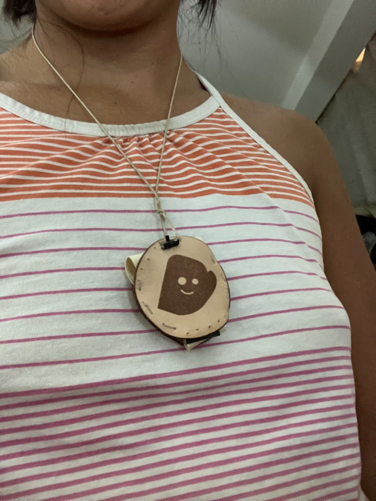
  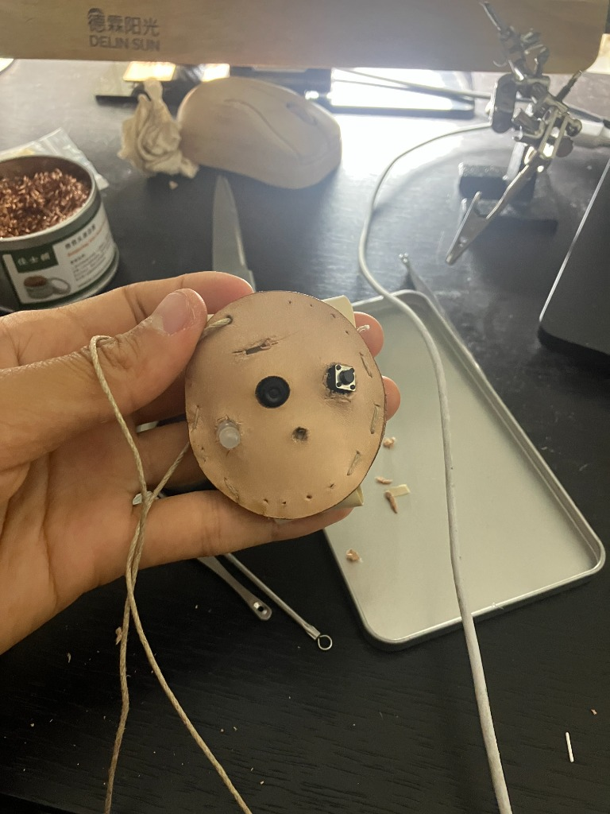
</p>

<p align="center">
  
  
</p>

**First conversation (May 10, 2026):** Susanna said "Hey Mittens, I'm so happy I made you!" and Mittens replied "That sounds like such a wonderful achievement! It looks like you are beaming with happiness in that photo."

<p align="center">
  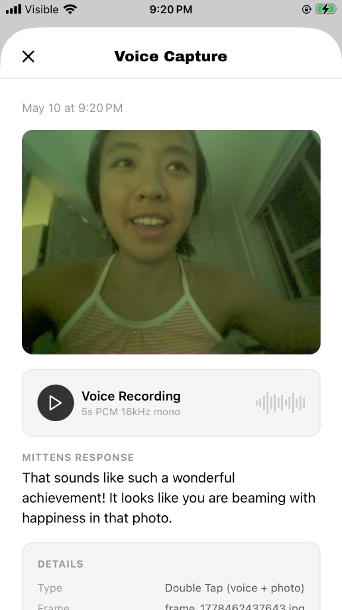
  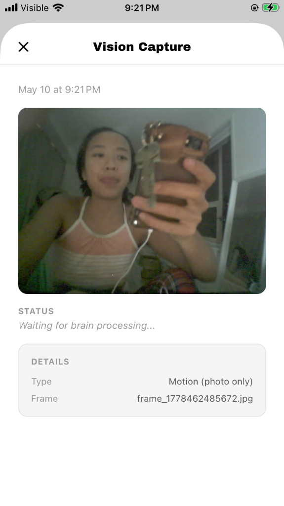
  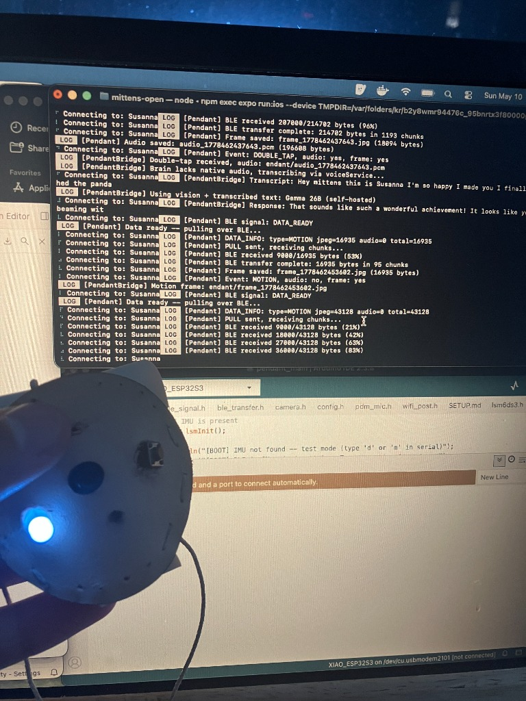
</p>

**Hardware wiring:**

| XIAO Pin | GPIO | Connection |
|----------|------|------------|
| D1 | GPIO2 | Push-to-talk button → GND (internal pullup) |
| D2 | GPIO3 | LSM6DS3 INT1 (motion wake, deep sleep wake source) |
| D3 | GPIO4 | LSM6DS3 INT2 (reserved) |
| D4 | GPIO5 | LSM6DS3 SDA |
| D5 | GPIO6 | LSM6DS3 SCL |
| D6 | -- | LED anode (active high, capture indicator) |
| 3V3 | -- | LSM6DS3 VCC |
| GND | -- | LSM6DS3 GND, LED cathode (via resistor), button |

LSM6DS3 SA0 tied to VCC (I2C address 0x6B).

**How it works:**
- **Push-to-talk button** (D1): hold to record audio, release to capture photo and send. Variable-length recording up to 10s. 16kHz PCM mono.
- **Motion detection** (IMU): LSM6DS3 triggers on movement, pendant captures a VGA JPEG and streams to phone. 3s cooldown between events.
- **Smart sleep**: stays awake while BLE is connected or there's been activity in the last 5 min. Enters deep sleep after 5 min idle. Wakes on button press or motion.
- **BLE transfer**: chunked notification protocol (180-byte chunks, 12ms pacing with periodic flush). App pulls data via PULL/DONE handshake. Concurrent pull protection prevents data corruption.
- **On-device STT fallback**: when the active brain doesn't support native audio (e.g. self-hosted Ollama), pendant audio is converted from raw PCM to WAV and transcribed locally using iOS Speech framework. The transcript is then sent as text to the brain alongside the photo.
- **Face recognition**: button-press and say "this is [Name]" to register a face. The on-device native module (Apple Vision for face detection, CoreML for 128-dim embedding extraction) saves the face print to local SQLite. During ambient social scenes, faces in motion frames are matched against known embeddings via cosine similarity. Recognition reinforces over time -- each new sighting saves another embedding from a different angle. Greetings are composed by the brain using the person's name, relationship, interaction history, and memories.
- **iOS background reconnect**: `restoreStateIdentifier` enables iOS to maintain BLE scanning even when the app is backgrounded or killed. Phone auto-reconnects when pendant wakes.
- **No WiFi required** — entirely Bluetooth Low Energy data transfer.
- Works with any brain mode (local E2B, self-hosted Ollama).

See [mittens_pendant/firmware/pendant_main/SETUP.md](mittens_pendant/firmware/pendant_main/SETUP.md) for hardware setup and flashing guide.

## The Vision

**Wrist band.** IMU for human activity recognition (eating vs typing), skin temp, PPG. Unlocks sleep staging, HRV, menstrual cycle tracking.

**Wardrobe & Object Tracking.** Using local vision models to recognize clothing and personal items, integrating seamlessly into a broader personal inventory system with AR visualization.

**Trading map.** Items marked "want to trade" flow from SUSU Closet to SUSU Map for local peer-to-peer trading.

**Production level Pendant.** Customized PCB with waterproof aluminum case with upgraded components and design, smaller, lighter. Higher quality camera for better food and cooking recognition.

## Hardware Roadmap: Wider Field of View

The stock camera on the XIAO ESP32S3 Sense has a ~66° lens. Mounted on the chest, this misses two things that matter for ambient logging:

- **Meal prep happening directly below the camera** — chopping, plating, what's actually on the cutting board.
- **Pantry and grocery movement that's off-axis** — reaching for items on a side shelf, items pulled from a low drawer, things handed over a counter.

### Dewarp considerations

Past ~120° you need to either correct distortion in firmware before uploading frames, or accept that anything sent to a vision model will look bent at the edges. Most modern vision models handle moderate fisheye fine; a plate of food at the far edge of a 160° frame will be visibly warped and that hurts classification accuracy. For **pantry and grocery tracking** — where the question is mostly *what's there* rather than *what does it look like* — this matters less. For **meal nutrition analysis**, it matters more, which is one reason food logging currently does better with a phone photo.

### Recommended pendant v2/v3 roadmap

| Version | Lens | Sensor | Strategy | Reason |
|---------|------|--------|----------|--------|
| v1 (today) | ~66° stock | OV2640 2MP | Single fixed lens | What's flashed and working |
| v2 (next iteration) | 120° wide-angle | OV2640 2MP | Drop-in, +30° downward tilt | Cheapest path to seeing prep surfaces |
| v2.5 | 120° wide-angle | OV5640 5MP, auto-focus | Crop-to-region in firmware | Restores per-object resolution despite wider lens |
| v3 (architecture shift) | 120° | OV5647 + WiseEye2 HX6538 | On-module always-on inference, ESP32 = BLE + audio + IMU only | Always-on observation at <10mW; sends events, not frames |

## Cost

$0/month. Gemma on-device. Bring your own self-hosted brain if you want.
