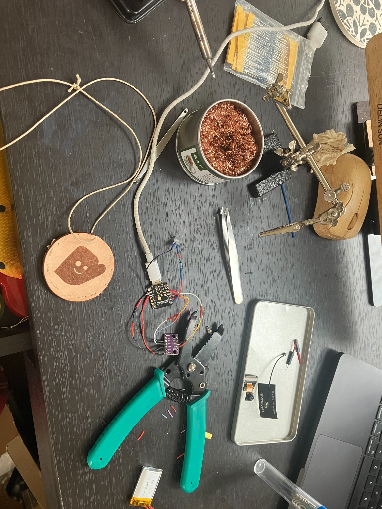
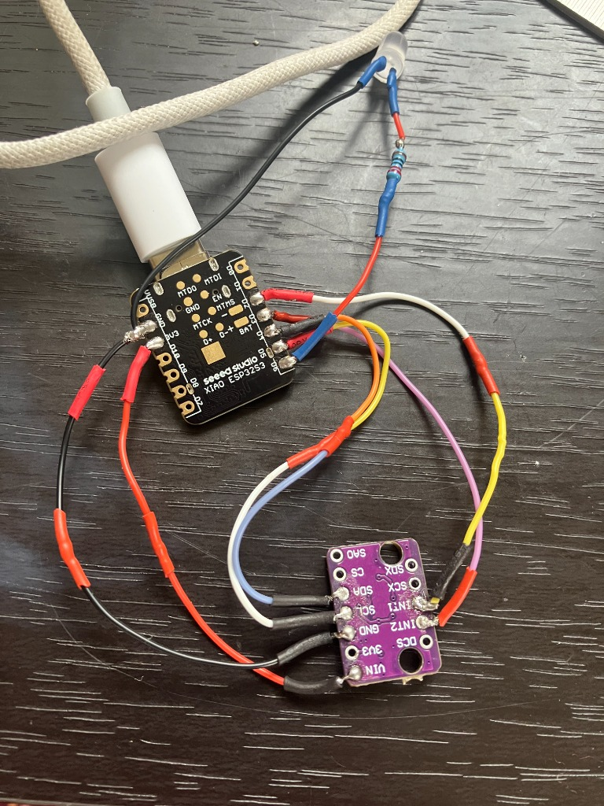

# Mittens Pendant — Arduino IDE Setup Guide

> XIAO ESP32S3 Sense + LSM6DS3 IMU

## 1. Install Arduino IDE

Download **Arduino IDE 2.x** from [arduino.cc/en/software](https://www.arduino.cc/en/software) (Apple Silicon native build).

## 2. Add ESP32 Board Package

1. Open **Arduino IDE → Settings** (⌘ + ,)
2. In **Additional Board Manager URLs**, paste:
   ```
   https://raw.githubusercontent.com/espressif/arduino-esp32/gh-pages/package_esp32_index.json
   ```
3. Click OK
4. Go to **Tools → Board → Boards Manager**
5. Search for **esp32** by Espressif Systems
6. Install **version 3.x** (v3.0.0+, required for `ESP_I2S.h` PDM mic API)

## 3. Select Board & Settings

Go to **Tools** and set:

| Setting | Value |
|---|---|
| **Board** | `XIAO_ESP32S3` |
| **USB CDC On Boot** | `Enabled` |
| **PSRAM** | `OPI PSRAM` |
| **Partition Scheme** | `Huge APP (3MB No OTA/1MB SPIFFS)` or `Maximum APP (7.9MB)` |
| **Upload Speed** | `921600` |
| **Port** | `/dev/cu.usbmodem*` (appears when board is plugged in) |

> **⚠️ PSRAM must be set to OPI PSRAM** — the camera and audio buffers are allocated in PSRAM via `ps_malloc()`. Without this, you'll get allocation failures.

## 4. Libraries

All libraries used are **built into the ESP32 Arduino Core** — no external library installs needed:

| Library | Source | Used For |
|---|---|---|
| `BLEDevice.h` / `BLEServer.h` | ESP32 Core (built-in) | BLE GATT server, notifications |
| `WiFi.h` / `HTTPClient.h` | ESP32 Core (built-in) | WiFi connection (dev fallback) |
| `Wire.h` | ESP32 Core (built-in) | I2C communication with LSM6DS3 |
| `Preferences.h` | ESP32 Core (built-in) | NVS persistent storage |
| `esp_camera.h` | ESP32 Core (built-in) | OV2640 camera capture |
| `ESP_I2S.h` | ESP32 Core v3+ (built-in) | PDM microphone recording |
| `driver/rtc_io.h` / `esp_sleep.h` | ESP-IDF (built-in) | Deep sleep + GPIO wake |

**No Library Manager installs required.** If the board package is installed correctly, everything compiles.

## 5. Hardware Wiring

The XIAO ESP32S3 Sense has the camera and PDM mic **built into the board**. External components are the **LSM6DS3 IMU** breakout, an **LED**, and a **push-to-talk button**:

<p align="center">
  
  
</p>

```
XIAO ESP32S3 Sense          LSM6DS3
─────────────────           ────────
D4 (GPIO5)  ───────────── SDA
D5 (GPIO6)  ───────────── SCL
D2 (GPIO3)  ───────────── INT1  (wake-up motion, deep sleep wake source)
D3 (GPIO4)  ───────────── INT2  (button-press detection)
3V3         ───────────── VCC
GND         ───────────── GND
                          SA0 -> VCC (address 0x6B)

XIAO ESP32S3 Sense          LED
─────────────────           ───
D6          ───────────── Anode (+)
GND         ───────────── Cathode (-) via resistor

XIAO ESP32S3 Sense          Push-to-Talk Button
─────────────────           ───────────────────
D1          ───────────── One leg
GND         ───────────── Other leg  (uses internal pullup)
```

> The LED lights up whenever the pendant captures a photo (motion) or records audio (button-press/button).
> The button is used for **push-to-talk**: hold to record, release to stop and send.

## 6. First Flash

1. Connect the XIAO ESP32S3 to your Mac via USB-C
2. If the port doesn't appear in **Tools → Port**:
   - Hold the **BOOT** button on the XIAO
   - While holding BOOT, press and release **RESET**
   - Release BOOT — the board enters bootloader mode
   - The port should now appear as `/dev/cu.usbmodem*`
3. Open `pendant_main.ino` in Arduino IDE
4. Click **Upload** (→ button)
5. Wait for compilation and upload to complete
6. Open **Serial Monitor** (🔍 button) at **115200 baud**
7. Press the RESET button on the XIAO — you should see:
   ```
   [BOOT] Mittens Pendant v3 -- boot #1 (cold boot)
   [BOOT] Starting BLE...
   [BOOT] BLE advertising -- phone can connect now
   [IMU] LSM6DS3 online (WHO_AM_I=0x69)
   [BOOT] Ready! BLE advertising, IMU armed.
   [BOOT] BUTTON (D1): hold to talk | MOTION: auto-capture
   [BOOT] Sleep after 5 min idle
   ```

## 7. Usage

**Push-to-talk (button on D1):**
- Hold the button → LED turns on, mic starts recording
- Release the button → recording stops, photo captured, data sent to phone via BLE
- Variable-length recording (up to 10s)

**Motion detection (automatic):**
- Shake or move the pendant → photo captured and sent to phone
- 3-second cooldown between motion events

**Serial commands** (via Serial Monitor):
- **`d`** — simulate a push-to-talk event (audio + photo)
- **`m`** — simulate a motion event (photo only)
- **`s`** — status dump (BLE state, button state, idle timer, time to sleep)

**Sleep behavior:**
- Stays awake while BLE is connected or there's recent activity
- Enters deep sleep after 5 minutes idle (no connection, no motion, no button)
- Wakes from deep sleep on button press or motion
- 30-minute fallback timer wake

## 8. Testing Without IMU

If the LSM6DS3 isn't wired up, the firmware enters **test mode**:
```
[BOOT] IMU not found -- test mode (type 'd' or 'm' in serial)
[BOOT] BLE is ON and advertising. Try connecting from phone.
```
BLE still works in test mode — use serial commands to trigger events.

## 9. Troubleshooting

| Problem | Fix |
|---|---|
| `esp_camera.h: No such file` | Board package not installed or wrong board selected. Must be `XIAO_ESP32S3`. |
| `ESP_I2S.h: No such file` | ESP32 Core version too old. Need **v3.0.0+**. Update in Board Manager. |
| Upload fails with "no port" | Hold BOOT → press RESET → release BOOT to enter bootloader mode. |
| `ps_malloc returned NULL` | PSRAM not enabled. Set **Tools → PSRAM → OPI PSRAM**. |
| Camera init fails `0x103` | Camera already initialized. Firmware auto-deinits between captures. Press RESET if stuck. |
| `[IMU] Not found (WHO_AM_I=0x00)` | Check I2C wiring (SDA→D4, SCL→D5). Verify SA0→VCC for 0x6B. Check INT1→D2. |
| BLE transfer timeout | Phone may have multiple concurrent pull attempts. App has `isPulling` guard to prevent this. Reload app. |
| Audio plays too fast/slow | Firmware records at 16kHz. Ensure app decodes PCM at 16kHz mono 16-bit. |

